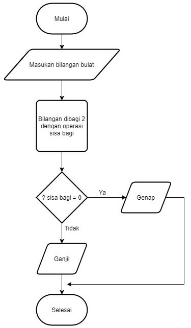

# Introduction Algorithm

#### Apa itu Algoritma ?

Algoritma adalah prosedur komputasi (langkah-langkah) yang didefinisikan dengan baik yang mengambil beberapa nilai sebagai input dan menghasilkan beberapa nilai sebagai output.

#### Contoh Algoritma
- Check Prime Number
- Sorting
- Searching

#### Karakteristik Algoritma
- Memiliki batas (Awal dan Akhir)
- Intruksi terdefinisi dengan baik
- Efektif & Efisien (cepat)

#### Algoritma Dasar
- Sequential (pencarian secara berurutan)
- Brancing (percabangan, if else)
- Looping (perulangan, for while)

----

#### Apa itu Pseudocode ?

Pseudocode adalah sebuah kode/tanda/notasi yang merupakan penjelasan untuk cara menyelesaikan suatu masalah.

#### Karakteristik Pseudocode

- Menggunakan pola bahasa inggris yang sederhana
- Tidak memiliki standar aturan tertentu dalam penulisannya
- Menggunakan simbol atau syntax dari suatu program, seperti <-,< >, <=, >=, -> dan sebagainya

#### Notasi/Syntax Pseudocode

- INPUT (untuk memasukkan sesuatu)
- OUTPUT (untuk menampilkan sesuatu)
- WHILE (proses dibalik layar)
- REPEAT x UNTIL y (proses perulangan x sampai dengan y)
- IF a THEN b ELSE c, (logika yang menjelaskan jika A, maka B, jika tidak maka C)

-----

#### Apa itu Flowchart ?

Flowchart adalah sebuah diagram yang menjelaskan alur proses dari sebuah program.

#### Simbol Flowchart
<!--  -->

#### Contoh Flowchart
<!--  -->

## Referensi

- [Dicoding Indonesia](https://www.dicoding.com/blog/flowchart-adalah/)
- [KitaLulus](https://www.kitalulus.com/gaya-hidup/pseudocode-adalah)
